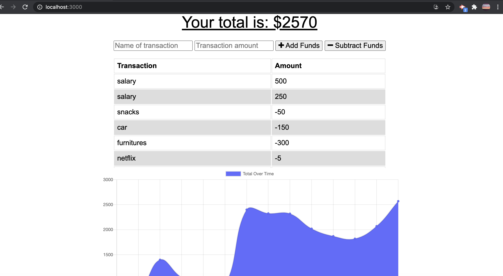
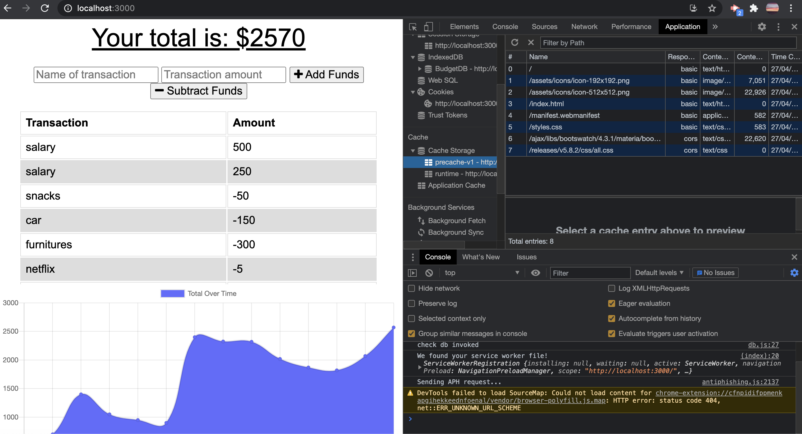
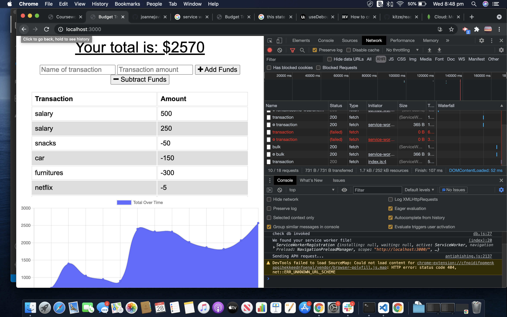
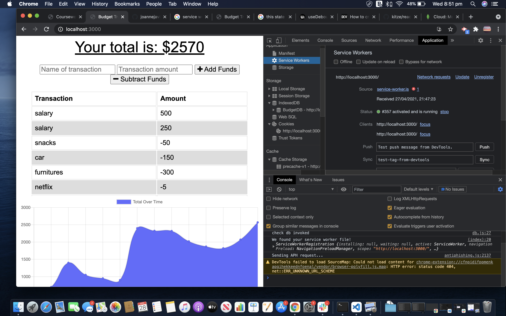

# budget-tracker

## Description 
- This project- the budget-tracker was created using Mongo database with a Mongoose schema and handle route with Express, IndexedDB, service-worker.
- The application should be able to let the user track his/her expenses even if there is no internet connection.
- The user should enable to track the his/her finances, by adding expenses and deposits to their budget with or without connection. 
- When they enter their transaction offline, it should populate the total when brought back online.

 ---
# Table of Contents 

  - [Description](#Description)
  - [Technologies](#Technologies)
  - [Links](#Links)
  - [Screenshots](#Screenshots)
  - [License](#License)
  - [Questions](#questions)
---

## Technologies
node js, npm, mongodb, mongoose , service-worker, webpack configuration, manifest, indexedDB, Heroku

---
## Links
 - Github: (https://github.com/joannejavillo/budget-tracker)
 - Heroku: ()
 
---
## Screenshots
 
"The Budget Tracker"
---

 
"The cache storage"

 
"The offline-online functionalities"

"The service worker"

---
## License
- MIT
---
## Questions
If you have any questions you can contact me at jo_anne.javillo@outlook.com or you can visit my gitHub page: (https://github.com/joannejavillo)